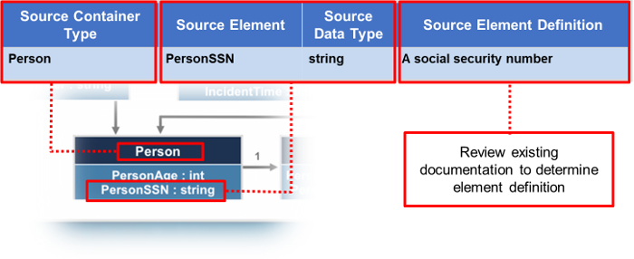
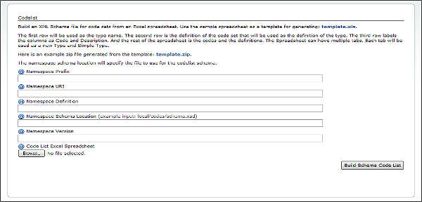

{{ page.description}}



# Build and Validate an IEPD

An Information Exchange Package (IEP) contains Information Exchange Package Documentation (IEPD) that you need to generate and validate to ensure NIEM conformance:

- Mapping Document that matches your exchange data elements to the NIEM data model

- XML schemas and other XML documents generated from NIEM tools

## Map and Model

### Mapping Document

The Mapping Document identifies how exchange data aligns to, or "maps," and reuses NIEM data objects. It is also referred to as a Component Mapping Template (CMT), Component Mapping Tool, or Mapping Spreadsheet.

- Demonstrates how data objects within an exchange map to data objects in NIEM by recording the degree of similarity

- Aids the identification process of objects that are not currently within NIEM and are candidates for inclusion in an extension schema

- Helps communicate the level of reuse in NIEM to business users/owners

A template is available for use on NIEM.gov.

#### Source Data Colummns (A)

| Source Container Type | Source Element | Source Data Type | Source Element Definition |
| --- | --- | --- | --- |
| The data source high-level object, class, or context of a set of data elements (e.g., person, vehicle, arrest) | The source element is a specific data element that is associated with the Source Container Type | Data type of the source element | The definition of the source element being mapped |
| **Example** |
| Person | DateofBirth | Date | Date of birth of a person |

#### NIEM Data Columns (B)

| NIEM Element | NIEM Element Path | NIEM Type | NIEM Element Definition |
| --- | --- | --- | --- |
| The name of the NIEM element the source element is mapped to | The path of the NIEM Element within the NIEM Model | The name of the type that is associated with the NIEM element | The standard definition for the NIEM element found in the element’s metadata |
| **Example** |
| nc:PersonBirthDate | nc:Person/nc:PersonBirthDate | nc:DateType | A date a person was born |

#### Mapping Column (C)

In a Mapping Document, you must search the NIEM model for appropriate data elements to map to local exchange data. If a NIEM element is found, the correlation of the source and NIEM elements is recorded here.

| Mapping |
| --- |
| Identifies how the source object or element maps to the NIEM object or element. |
| **Example** |
| Equivalent |

The **Mapping** value is the degree to which a source element maps to a NIEM element. Possible values include the following:

| Value | What It Means |
| --- | --- |
| Equivalent | Semantics and structure map exactly or almost exactly.  The NIEM data object’s name and definition should have exactly the same conceptual meaning as the exchange data object. |
| Partial | Partial Match is where you can take some things from NIEM and have to extend the rest for a given Type. In other words, when the semantics or structure of an exchange and NIEM data objects do not exactly fit. |
| No Match | No NIEM element or type maps to the source requirement.  The result is an extension to NIEM through an IEPD extension schema. |

##### Notes on Equivalent Match

- If a NIEM object has similar semantics and structure to an exchange data object, it is probably an equivalent match.

- Equivalent matches can be difficult to find due to complex containers and different names.

- As a first check, verify that the NIEM data object’s definition and its containing objects logically align to the exchange object.

##### Equivalent Match Examples

| Exchange Data | NIEM Data Objects |
| --- | --- |
| Person | nc:Person |
| Person Name | nc:Person/nc:PersonName |
| Person First Name | nc:Person/nc:PersonName/nc:PersonGivenName |

##### Notes on Partial Match

- This match is the most difficult mapping to find in the NIEM data model. It is the gray area that exists between **Equivalent** and **No Match**.

- Most partial matches can be categorized into three conflict categories:
  - semantic
  - structural
  - container

- Mitigations exist for each of these three categorizes that will maintain the integrity of the NIEM data model.

- In spite of these mitigations, there are cases where an exchange object will not map to the NIEM data model.

##### Partial Match Examples

| Conflict Description | Example(s) | Mitigation |
| --- | --- | --- |
| **Semantic:** Occurs when there is a small discrepancy in definition or name | **nc:Date** does not align exactly with **local-ns:EntryDate** | Reuse the NIEM data type and create a local element. |
| **Structural:** Occurs when the NIEM data object has constraints that disallow a direct mapping of the exchange data object. | Data type mismatches; Code lists (enumeration facets) do not have all necessary entries. | Reuse the NIEM element and either create a new data type or extend a NIEM base type. |
| **Container:** Occurs when an exchange data object hierarchy does not match the hierarchy of a desired NIEM data object. | Data object contains (or is contained within) elements or types that do not make logical sense or align well. | Reuse the NIEM element or type but create local elements or types to contain them. |

##### Notes on No Match

- Similar to some partial matches, the result is an extension to NIEM contained in an IEPD extension schema.

- When a **No Match** occurs, a new element is created for the exchange object.

- A number of obvious cases will almost always have a **No Match**:
  - Specific local information, such as code tables (enumeration facets).
  - A “new” government or private sector issue or data object that has not made it into the model.
  - Uncommon data, such as something very specific to a particular organization.

##### No Match Examples

| Exchange Data | Mapping Value* | NIEM Data Objects |
| --- | --- | --- |
| Cargo Ship | Partial Match | nc:Vessel |
| Hazmat Indicator | No Match | nc:Vessel/local |
| | | ns:HazmatIndicator |

\* **Mapping Value** is intended to show the difference between a Partial Match and No Match.

#### Final Considerations

You should include additional notes in the mapping document to provide reasoning and context. When mapping, be conservative in extending NIEM data objects to maintain the integrity of the NIEM data model.

### Mapping Process

The mapping process is composed of two steps:

1. Set up a Mapping Document

1. Search and Map NIEM Elements

#### Set up a Mapping Document

Do the following for the initial setup of the document:

1. Identify an object within the exchange content model as your starting point for entry in the document. This is the **Source Container Type** (the containing object to which elements belong).
1. Identify an element within that object. This is the **Source Element**.
1. Identify the data type for the element. This is the **Source Data Type**.
1. Provide a definition for the element. This is the **Source Element Definition**.
1. Repeat the previous steps for each object in the **Exchange Content Model**.

**Example**

Four columns should be filled in for every element within the exchange content model

#### Search and Map NIEM Elements

Do the following to find NIEM elements that may have the same logical definition, semantics, and structure as source elements.

1. Use a NIEM tool (e.g., Schema Subset Generation Tool (SSGT)), find an element from a NIEM reference schema that “maps” to the exchange data element.

")

1. Try searching by name, for synonyms, conceptual meaning, or by type.

1. Map objects that are conceptually and semantically equivalent. If the alignment is not easily understood, it is better to extend.

1. Document the information about the NIEM data object, including the type of mapping (equivalent, partial, no match), if one is found.

#### Model Searching Tips

| Search Method | Explanation | Example |
| --- | --- | --- | --- |
| Name Variations | Searching for variations of a name can often yield results | Search for **Officer** instead of **Official** to yield **j:EnforcementOfficial** |
| Conceptual Meaning | Search for words that could be in the definition of the data object | Search for **Modified Charge** to yield **j:AmendedCharge** |
| Synonyms | Synonyms of the data object to find exactly what you are looking for | Search for **Facility** instead of **Building** to get different results |
| Containers | Use a more abstract term to find containers of the data objects | Search for **Person** instead of **Person Arrest** to get the maximum number of results |

#### Notes on Reuse of the NIEM Data Model

The hierarchical implications of the model must be considered when reusing NIEM elements. NIEM’s hierarchal approach to modeling allows for flexibility and reuse, while still maintaining context.

- Elements and types are defined globally and referenced when used.

- Type hierarchy provides a contextual representation of the element.

- Attributes are assigned to some types to provide context on their use.

")

## Build and Validate

### Create XML Schemas & Artifacts

Data objects identified in the mapping document will appear in either the exchange, extension, or subset schemas. Associations and cardinality from the exchange content model will be reflected in XML schemas.

#### NIEM-Conformant XML Schema Generation

XML schemas that are typically created for an IEPD include subset, exchange, extension, constraint, and reference. A NIEM-conformant IEPD is required to constrain at least one schema that is either a NIEM reference schema or subset schema. XML schemas for NIEM-conformant exchanges can be created in two ways:

| Method | Process |
| --- | ---|
| Generation Through Tools | Automatically generate schemas based on an exchange content model, mapping document, or other inputs. |
| Coded by Hand | Start with existing schemas or NIEM schema templates, which can be derived from NIEM reference schemas. |

It is recommended that you start with tools and modify as needed.

##### The NIEM Tools Catalog

The NIEM Tools catalog provides a marketplace for a number of different tools that aid in schema generation. The **Code List Generator**, for example, provides you with the ability to build an XML schema file for code sets from an Excel spreadsheet.

The NIEM Tools Catalog resides at [NIEM Tools Catalog](https://www.niem.gov/tools-catalog "NIEM Tools Catalog").

The Code List Generator resides at [Code List Generator Tool](https://www.niem.gov/CLG "Code List Generator Tool")

#### Create a Subset Schema

Subset schemas are constructed by reusing the elements and types needed for the exchange from NIEM reference schemas.

#### Subset Schema Considerations

- A subset schema is a required artifact of an IEPD and should be NIEM-conformant.

- A subset schema should always validate against the entire reference schema.

- A subset schema can be generated using a number of tools from a variety of inputs (e.g., Wantlists, XMI files).

### Validate XML Schemas
