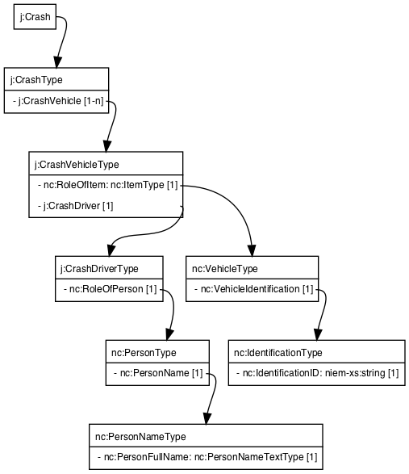

{{ page.description }}

    <b><i>ConTesA</i> – a web-based NIEM conformance testing tool.</b>

    <a class="btn btn-primary btn" href="{{contesa_url}}" target="_blank">
      Visit ConTesA
    </a>



## The ConTesA Tool
-------------------
This introduction to *ConTesA* will show you how to use *ConTesA* to
validate a test document for NIEM conformance and how to trace down
common mistakes in developing a NIEM conformance document.

### Prerequisites

To complete this tutorial, you'll need internet access and a
[ConTesA account]({{contesa_url}}/registration). You'll also need to be
familiar with at least one of the supported NIEM data formats (i.e.
[XML]({{xml_source_url}}), [JSON]({{json_source_url}}), or
[RDF]({{rdf_source_url}})) and your favorite text editor.

{:.note}
> We use XML as the data format for in this tutorial.

## Step 1: Create a Data Model
------------------------------
*ConTesA* currently uses XML or XML Schema (XSD) as input for validation
against the NIEM NDR. XSD is used to prescribe a set of formatting rules
for an XML document (call an XML instance document) and is, itself,
specified in XML format; thus, subject to XSD formatting rules.

In this step, we're going to create a few XML and XSD documents to input
into *ConTesA*.

### Define Data Requirements

Scenario: One organization would like to represent the relevant data of
traffic accidents, namely crashes, using the NIEM standard. Let's 
establish a simple set of data requirements necessary to represent the
relevant information in these "crash" reports:

* Crash Driver Information
  * Person
    * Date of Birth
    * Name
  * Crash
    * Incident Location
    * Vehicle
      * Driver
        * Role
        * License
      * Vehicle Identification Number

### Extract NIEM Components

Once we've defined our data requirements we can use the NIEM
Subset Generation Tool (SSGT) to extract the necessary components
to build a NIEM IEPD.

{:.tip}
> SSGT is a great tool for searching the list of prefabricated
NIEM components to prevent extraneous work. Check out the [SSGT
tools page](../ssgt) if you are not yet familiar with it.

Knowing our requirments and the components of NIEM, our model might take a form like:

<figure>
<figcaption><b>File: <i>naive_person_name.xml</i></b></figcaption>



</figure>

This document is valid XML; it follows all of the standard XML 1.0 rules
and is straightforward to parse with any well-founded XML parser. However,
this document is not NIEM compliant. In [Step 3](#step-3-review-the-conformance-report)
we'll see how *ConTesA* evaluates this document against the NIEM NDR.

### Person Name Schemafied

In this second document, let's try to be a bit more NIEM aware. Rule 12-1
of the NIEM NDR requires, in so many words, that an XML instance document
must reference a valid XML Schema:



Let's create an XML Schema which establishes *PersonName* as the root
element of an XML instance document derived from the schema. With your
favorite text editor, create a file called "naive_person_name.xsd"
containing the following text:

<figure>
<figcaption><b>File: <i>naive_person_name.xsd</i></b></figcaption>



</figure>

From this valid XML Schema document, we can now regenerate our "naive"
XML document as and XML instance document. Create the following file
called "naive_person_name_instance.xml":

<figure>
<figcaption><b>File: <i>naive_person_name_instance.xml</i></b></figcaption>



</figure>

### Moving Towards NIEM

The NIEM NDR has a lot to say about how we write an XML Schema.
If we want a product that passes *ConTesA*'s tests, we need to also
adhere to those rules:

<figure>
<figcaption><b>File: <i>niemish_person_name.xsd</i></b></figcaption>



</figure>

<figure>
<figcaption><b>File: <i>niemish_person_name_instance.xml</i></b></figcaption>



</figure>

### NIEM: The Full Monty

NIEM actually provides a fully realized "Person Name" data model. Let's look at
how NIEM implements *PersonName* in NIEM 4.0:

<figure>
<figcaption><b>File: <i>niem_person_name.xsd</i></b></figcaption>



</figure>

<figure>
<figcaption><b>File: <i>niem_person_name_instance.xml</i></b></figcaption>



</figure>

## Step 2: Uploading to ConTesA
-------------------------------
Login to your *ConTesA* account